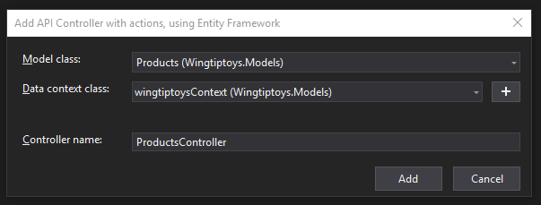

# Tecsys' Wingtiptoys Coding Exam

## Stand-up

- Open new Visual Studio 2019 session
- Scaffold new project for ASP.NET Core 3.1 API with Angular (SPA)
- init git, create new github repo, add remotes (origin), and push 'first'
- Copy database files named wingtiptoys.mdf, and wingtiptoys_log.ldf to C:\Program Files\Microsoft SQL Server\MSSQL14.SQLEXPRESS\MSSQL\DATA and use SSMS_to Attach
- Add EF Core packages (v 3.1.5):
  - Microsoft.AspNetCore.App
  - Microsoft.EntityFrameworkCore.Tools
  - Microsoft.VisualStudio.Web.CodeGeneration.Design
- Scaffold EF Model

    ```
    Scaffold-DbContext "Server=.\sqlexpress;Database=wingtiptoys;Trusted_Connection=True;" Microsoft.EntityFrameworkCore.SqlServer -OutputDir Models
    ```

- Scaffold new Controller using `API Controller with actions, using EF`

    

- add product filtering
- add CarListComponent
- user [CSharp2TS](https://marketplace.visualstudio.com/items?itemName=rafaelsalguero.csharp2ts) VSCode ext to bring POCO to interface


## Plans
- add logging via serilog
- add swagger via swashbuckle (v 5.x)
